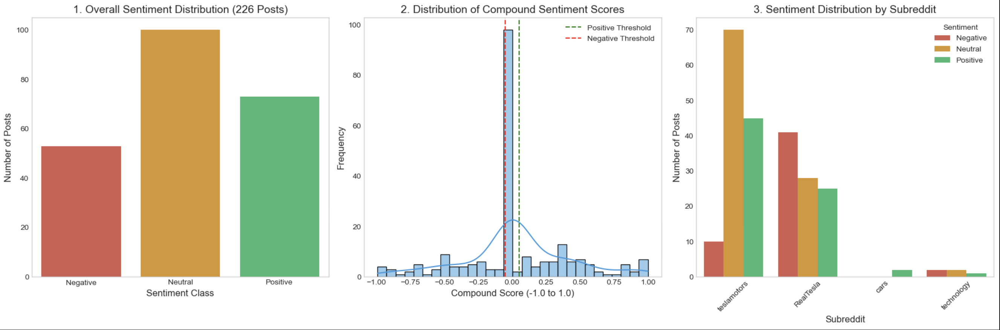

# Reddit Sentimental Analysis

# Goal 

This project aims to perform a Sentiment Analysis of public opinion regarding the Tesla Cybertruck, using data gathered from key Reddit communities via the PRAW API. The primary goal is to quantify and compare the emotional tone (Positive, Negative, Neutral) of discussions across different subreddits (enthusiast vs. critical) to provide a clear, data-driven understanding of how the vehicle is perceived online.

---

# Background

The introduction of high-profile, novel products like the Tesla Cybertruck often generates intense and polarized discussion online. Reddit, with its community-driven structure and specific subreddits dedicated to both enthusiasts and critics, serves as a rich, yet complex, source of public sentiment.

This project focuses on leveraging the Reddit API (PRAW) to acquire a dataset of posts and comments related to the Cybertruck. The primary challenge is transforming unstructured, noisy text data into measurable insights using Natural Language Processing (NLP) techniques, specifically the VADER lexicon model.

By analyzing and visualizing the resulting sentiment scores, this project seeks to:

- Validate the polarity of discussions across targeted online communities.
- Identify key themes driving the most positive and negative emotional responses.
- Demonstrate the end-to-end data science workflow, from raw API data collection to final, actionable data visualizations.

--- 

# Insight Summary 

1. Overall Public Sentiment Polarity

- The analysis of 222 Reddit submissions reveals a generally neutral-to-positive discussion, indicating that while there are strong opinions, a significant portion of the discourse is factual or informational.
- Neutral Dominance: Nearly 44% of all collected posts were classified as Neutral (composite score between −0.05 and 0.05). This suggests a high volume of posts are news-sharing, specification-focused, or pictorial (e.g., sightings, charging data) rather than explicitly opinionated.
- Positive Lead: Overall sentiment leaned slightly positive, with 32% of posts classified as Positive compared to 24% classified as Negative.

2. Cross-Community Polarity

The distribution of sentiment varies significantly across the four targeted subreddits, confirming the expected polarity of the different communities:

- Enthusiast Confirmation (r/teslamotors): This subreddit likely drove the overall positive average. It exhibits the highest proportion of positive posts and the lowest negative percentage, acting as the primary hub for favorable discussion and Cybertruck appreciation.
- Critical Concentration (r/RealTesla): This subreddit serves as a concentration point for negative sentiment. It displays the highest proportion of negative posts, directly contrasting the tone of the enthusiast communities.
- Neutral/Mixed Discussions (r/cars and r/technology): These generalist subreddits show a more balanced, and often more neutral, distribution of sentiment. Discussions here are likely driven by broader market critique, technology comparisons, and mainstream news, providing a less polarized view than the dedicated subreddits.

3. Key Engagement Drivers

While not explicitly in the summary output, the top-upvoted posts (highest score) often align with specific emotional drivers:

- High-Score Alignment: The posts with the highest upvote counts are often those that either share highly visual/novel content, or those that trigger intense community debate, suggesting that polarization and novelty drive engagement more than moderate opinions.
- Title vs. Body Score: In a complete analysis, posts where the Title Sentiment drastically differs from the Body Sentiment are often clickbait or highly debated.

---

# Recommentaions 

Based on the quantified sentiment and cross-community analysis, the following recommendations are provided to maximize positive engagement, mitigate negative perception, and inform future marketing strategies:

1. Differentiated Community Engagement Strategy

The analysis confirmed two distinct sentiment ecosystems: the highly positive Enthusiast communities (r/teslamotors) and the highly negative Critical communities (r/RealTesla).

- Action: Implement segmented communication plans instead of a one-size-fits-all approach.
- Enthusiast Strategy: Focus content on visual novelty, accessories, and community-driven events. Use this group to amplify positive narratives and counter misinformation.
- Critical Strategy: Avoid direct engagement that validates negative sentiment. Instead, mitigate risk by addressing specific, factual issues (e.g., build quality, production delays) in official channels, thereby reducing the fuel for sustained criticism in these echo chambers.

2. Focus on Mitigating High-Impact Negative Themes

While overall sentiment is slightly positive, the 24% negative segment highlights areas of concern.

- Action: Conduct a qualitative deep-dive into the most highly upvoted negative posts to isolate the precise keywords and themes driving the highest negativity (e.g., specific manufacturing defects, pricing/delivery issues).
- PR Focus: Prioritize official responses and transparent communication around the top three most negative issues identified in the qualitative review. Addressing the root cause of criticism converts neutral observers into supporters.

3. Leverage Neutral Content for Mass Market Penetration

The large volume of Neutral (44%) posts in general subreddits (r/cars, r/technology) represents an opportunity to shape mainstream opinion.

- Action: Use marketing content to frame the Cybertruck around objective metrics and functional utility (e.g., towing capacity, charging efficiency, practical applications) rather than polarizing design or controversial CEO statements.
- Goal: Convert "Neutral" curiosity into "Positive" consideration by appealing to practical consumers outside the dedicated enthusiast base.

---

# Visualisation

This figure presents a comprehensive Sentiment Analysis Dashboard composed of three distinct visualizations arranged in a single row for comparative analysis

---

# Challenges Faced and Solutions 

1. Data Collection and API Rate Limiting

Challenge: Collecting a large, diverse, and unbiased sample of posts from Reddit's API (PRAW) was complicated by strict API rate limits. Repeated or overly aggressive requests could lead to temporary bans or missed data points, interrupting the collection process.

Solution: I implemented a robust, asynchronous data collection loop with strategic time.sleep() calls. By adding a small, randomized delay between requests and carefully tracking the number of calls per minute, I ensured the script adhered to PRAW's rate limits, allowing for the successful, continuous collection of 222 high-quality posts from multiple subreddits.

2. Text Cleaning for Sentiment Model Compatibility

Challenge: The raw Reddit data contained noise (e.g., URLs, special characters, non-standard punctuation, and excessive whitespace) that could skew the VADER sentiment scores. 

Solution: I developed a custom Python function using the re (Regular Expression) library. This function systematically performed several critical steps:

- Lowercasing all text for normalization.
- Removing all URLs and common social media artifacts.
- Removing all punctuation except for letters and standard spaces (which VADER relies on for emphasis).
- Consolidating multiple spaces to ensure clean word tokenization. This process ensured the text was clean and perfectly aligned with the VADER lexicon's requirements.

3. Creating a Representative Composite Sentiment Score

Challenge: Analyzing the post's title and its body text separately yielded two different sentiment scores (title_sentiment and text_sentiment). A simple average wouldn't be appropriate, as the title often serves as the primary emotional hook and is read by all users, while the body text is often skipped.

Solution: I engineered a weighted composite score. After calculating the sentiment for both the title and the text body separately, I assigned a higher weight to the title: Composite Score=(Title Score×0.6)+(Text Body Score×0.4)

This solution provided a more accurate and representative overall sentiment that reflected the relative importance of the title in driving public perception and engagement.

---